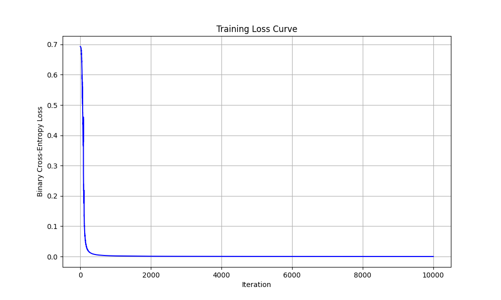
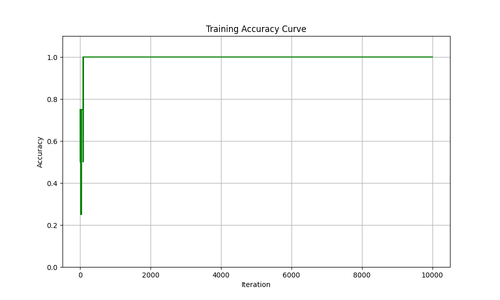
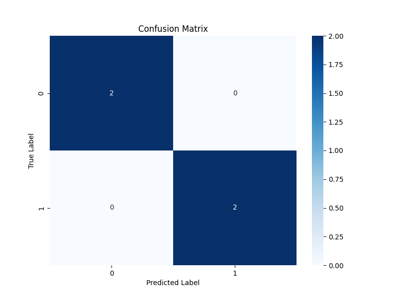

# Neural Network for XOR from Scratch

This project is a foundational exercise in building a 2-layer neural network from the ground up using only **NumPy**. The goal is to solve the classic XOR problem, demonstrating a grasp of the core mechanics of how neural networks learn.

This implementation was built iteratively, encountering and solving several common issues in training neural networks, such as vanishing gradients and the importance of choosing the correct loss and activation functions.

-----

## Core Concepts Implemented

  * **Neural Network Architecture:** A 2-layer network (one hidden layer, one output layer).
  * **Forward Propagation:** The process of passing inputs through the network to generate a prediction.
  * **Backpropagation:** The algorithm for calculating the gradients of the loss function with respect to the network's weights and biases.
  * **Gradient Descent:** The optimization algorithm used to update the network's parameters and minimize loss.
  * **Activation Functions:** Implementation and understanding of **ReLU** and **Sigmoid**.
  * **Loss Functions:** Implementation and understanding of **Binary Cross-Entropy (BCE)** and its advantages over Mean Squared Error (MSE) for classification.
  * **Vectorization:** Using matrix operations to process the entire batch of data simultaneously for efficiency.

-----

## How to Run

1.  Ensure you have Python and the required libraries installed:
    ```bash
    pip install numpy matplotlib scikit-learn seaborn
    ```
2.  Run the script from your terminal:
    ```bash
    python xor_nn_with_plots.py
    ```

The script will train the model, print the final loss and accuracy, and save the three analysis plots to the directory.

-----

## Results and Visualizations

The final trained model successfully learns the XOR pattern with 100% accuracy. The following plots visualize the training process and the final result.

### Training Loss Curve

This plot shows the Binary Cross-Entropy loss decreasing over 10,000 iterations. The smooth downward curve that flattens out near zero indicates that the model successfully converged to a solution.


### Training Accuracy Curve

This plot shows the model's accuracy on the training data at each iteration. It quickly rises to 1.0 (100%) and stays there, showing that the model learned the pattern effectively.


### Confusion Matrix

The confusion matrix gives a clear report card of the final model's performance. It shows that for both classes (0 and 1), there are 2 true predictions and 0 false predictions. This confirms the model is 100% accurate.

-----

## Key Learning Journey

The most valuable part of this exercise was the debugging process. The initial models failed to learn, which led to a deeper understanding of the underlying mechanics.

1.  **Initial Failure (Sigmoid + MSE Loss):** The first attempt used the Sigmoid activation in the hidden layer and Mean Squared Error (MSE) loss. The model got stuck, predicting `0.5` for all inputs. This was due to the **vanishing gradient problem**, where the weak gradients from the Sigmoid/MSE combination prevented the network from learning.

2.  **Second Failure (Sigmoid + BCE Loss):** We fixed the loss function by switching to **Binary Cross-Entropy (BCE)**, which is mathematically suited for a Sigmoid output. While this created a stronger error signal at the output layer, the Sigmoid in the hidden layer still dampened this signal, and the model failed to train.

3.  **Final Success (ReLU + BCE Loss):** The final, successful model uses the **ReLU** activation in the hidden layer. ReLU's derivative does not saturate, allowing the strong error signal from the BCE loss to flow all the way back to the first layer's weights. This combination of **ReLU (hidden) + Sigmoid (output) + BCE (loss)** is a standard and robust pattern in modern neural networks.